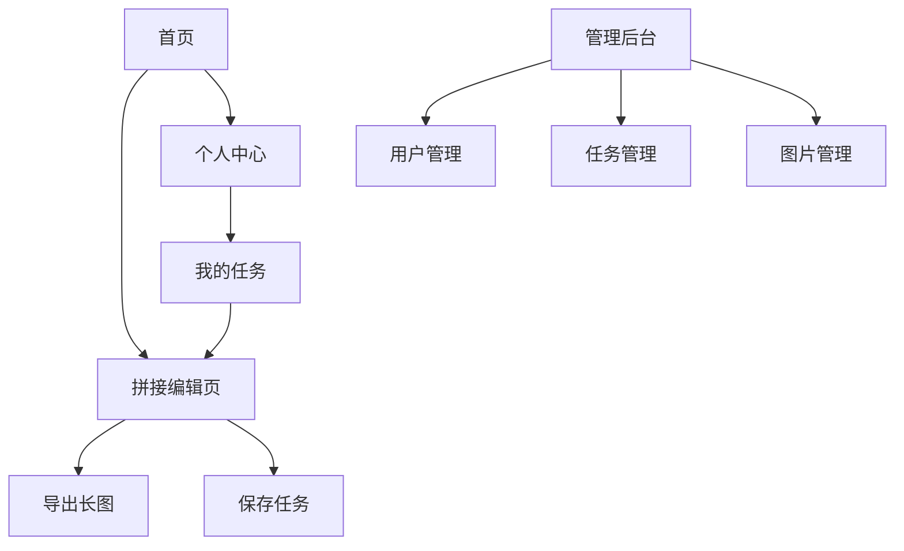

## 1. 产品概述
拼图应用(Pintu)是一款解决用户图片拼接需求的工具，突破朋友圈9张图限制，提供高质量长图导出功能。
用户可自由选择拼接方向，实时预览效果，保存编辑任务随时继续，管理员可通过后台系统维护用户数据和任务记录。

## 2. 核心功能

### 2.1 用户角色
| 角色 | 注册方式 | 核心权限 |
|------|----------|----------|
| 普通用户 | 手机号注册/登录 | 创建拼接任务、上传图片、导出长图、管理个人任务 |
| 管理员 | 后台添加账号 | 管理所有用户、查看所有任务、管理用户上传的图片 |

### 2.2 功能模块
拼图应用包含以下核心页面：
1. **首页**: 任务列表、新建拼接任务、快速上传入口
2. **拼接编辑页**: 图片选择、拼接方向选择、实时预览、导出长图
3. **个人中心**: 个人信息、我的任务列表、设置
4. **管理后台首页**: 数据统计概览
5. **用户管理页**: 用户列表、用户详情、用户状态管理
6. **任务管理页**: 所有任务列表、任务详情、任务状态管理
7. **图片管理页**: 所有图片列表、图片预览、图片删除

### 2.3 页面详情
| 页面名称 | 模块名称 | 功能描述 |
|----------|----------|----------|
| 首页 | 任务列表 | 显示用户所有保存的拼接任务，包含任务名称、创建时间、最后修改时间 |
| 首页 | 新建任务 | 点击创建新的图片拼接任务，跳转到拼接编辑页 |
| 拼接编辑页 | 图片选择 | 支持多选图片，可拖拽调整顺序，显示图片缩略图 |
| 拼接编辑页 | 拼接方向 | 提供向下拼接和向右拼接两种选项，实时预览效果 |
| 拼接编辑页 | 预览区域 | 实时显示拼接效果，支持缩放查看细节 |
| 拼接编辑页 | 导出功能 | 一键导出为长图，支持PNG格式下载 |
| 拼接编辑页 | 保存任务 | 保存当前拼接配置，下次可继续编辑 |
| 个人中心 | 个人信息 | 显示用户昵称、手机号、注册时间 |
| 个人中心 | 我的任务 | 列出个人所有任务，支持删除和继续编辑 |
| 管理后台首页 | 数据统计 | 显示用户总数、任务总数、图片总数等关键指标 |
| 用户管理页 | 用户列表 | 分页显示所有用户，支持搜索和筛选 |
| 用户管理页 | 用户详情 | 查看用户基本信息和任务统计 |
| 任务管理页 | 任务列表 | 显示所有用户的拼接任务，支持按用户筛选 |
| 任务管理页 | 任务详情 | 查看任务包含的图片和拼接配置 |
| 图片管理页 | 图片列表 | 显示所有用户上传的图片，支持预览和删除 |

## 3. 核心流程

### 普通用户流程
用户打开应用 → 注册/登录 → 进入首页 → 选择新建任务或继续编辑 → 上传图片 → 选择拼接方向 → 预览效果 → 导出长图或保存任务 → 完成任务

### 管理员流程
管理员登录后台 → 查看数据统计 → 管理用户（查看、禁用等）→ 管理任务（查看详情、删除等）→ 管理图片（预览、删除等）

## 4. 用户界面设计

### 4.1 设计风格
- **主色调**: 清新蓝色 (#1890ff) 搭配白色背景
- **按钮样式**: 圆角矩形，主要操作为实心按钮，次要操作为线框按钮
- **字体**: 系统默认字体，标题16px，正文14px，辅助文字12px
- **布局风格**: 卡片式布局，内容区域留白充足，操作按钮底部固定
- **图标风格**: 使用简洁的线性图标，保持一致性

### 4.2 页面设计概述
| 页面名称 | 模块名称 | UI元素 |
|----------|----------|--------|
| 首页 | 任务卡片 | 白色卡片包含任务缩略图、任务名称、创建时间，卡片间距16px |
| 拼接编辑页 | 图片选择区 | 网格布局显示已选图片，支持拖拽排序，每张图片显示删除按钮 |
| 拼接编辑页 | 方向选择 | 两个圆形按钮分别表示向下和向右拼接，选中状态高亮显示 |
| 拼接编辑页 | 预览区 | 灰色背景展示拼接效果，支持手势缩放，底部显示导出和保存按钮 |
| 管理后台 | 数据卡片 | 彩色卡片显示统计数据，数字大字体突出显示 |
| 管理后台 | 表格列表 | 简洁的数据表格，支持分页和搜索，操作按钮集中显示 |

### 4.3 响应式设计
应用采用H5技术，适配移动端各种屏幕尺寸，确保在手机和平板上都有良好的使用体验。管理后台主要面向桌面端使用，采用固定宽度设计。