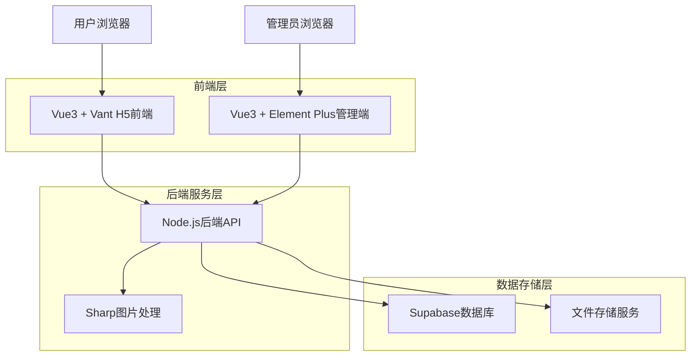
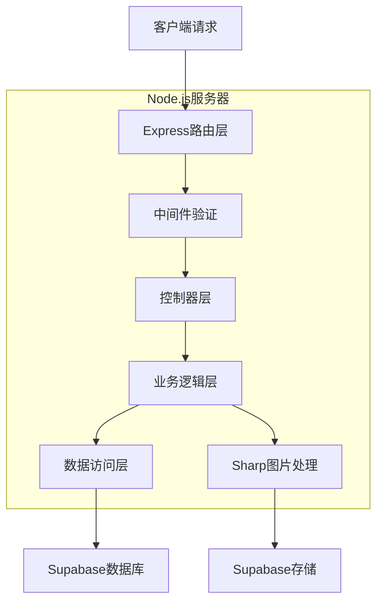
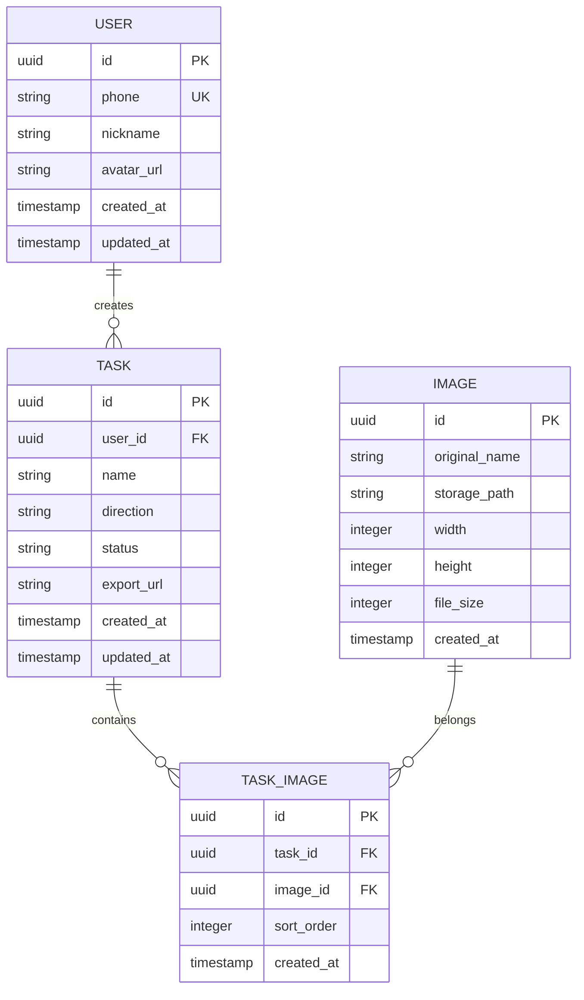

## 1. 架构设计



## 2. 技术描述

- **H5前端**: Vue3@3.3 + Vant@4 + Vite
- **管理端**: Vue3@3.3 + Element Plus@2 + Vite
- **初始化工具**: vite-init
- **后端**: Node.js@18 + Express@4 + Sharp@0.32
- **数据库**: Supabase (PostgreSQL)
- **文件存储**: Supabase Storage

## 3. 路由定义

### H5前端路由
| 路由 | 用途 |
|------|------|
| / | 首页，显示用户任务列表 |
| /edit/:id | 拼接编辑页，处理图片拼接 |
| /profile | 个人中心，用户信息管理 |
| /login | 登录页，用户认证 |

### 管理端路由
| 路由 | 用途 |
|------|------|
| /dashboard | 管理后台首页，数据统计 |
| /users | 用户管理页面 |
| /tasks | 任务管理页面 |
| /images | 图片管理页面 |
| /login | 管理员登录 |

## 4. API定义

### 4.1 用户认证相关
```
POST /api/auth/login
```

请求参数：
| 参数名 | 类型 | 必填 | 描述 |
|--------|------|------|------|
| phone | string | 是 | 手机号 |
| code | string | 是 | 短信验证码 |

响应：
```json
{
  "token": "jwt_token_string",
  "user": {
    "id": "uuid",
    "phone": "13800138000",
    "nickname": "用户昵称"
  }
}
```

### 4.2 任务管理相关
```
POST /api/tasks
```

创建拼接任务：
| 参数名 | 类型 | 必填 | 描述 |
|--------|------|------|------|
| name | string | 是 | 任务名称 |
| direction | string | 是 | 拼接方向：down/right |
| images | array | 是 | 图片ID数组 |

响应：
```json
{
  "taskId": "uuid",
  "status": "created"
}
```

### 4.3 图片上传相关
```
POST /api/images/upload
```

表单数据：
- file: 图片文件
- taskId: 关联任务ID

响应：
```json
{
  "imageId": "uuid",
  "url": "https://storage.supabase.co/image.jpg",
  "width": 1080,
  "height": 1920
}
```

### 4.4 图片拼接导出
```
POST /api/tasks/:id/export
```

响应：
```json
{
  "downloadUrl": "https://storage.supabase.co/exported_image.jpg",
  "fileSize": 2048576
}
```

## 5. 服务器架构图



## 6. 数据模型

### 6.1 数据模型定义


### 6.2 数据定义语言

用户表 (users)
```sql
CREATE TABLE users (
    id UUID PRIMARY KEY DEFAULT gen_random_uuid(),
    phone VARCHAR(20) UNIQUE NOT NULL,
    nickname VARCHAR(50) NOT NULL,
    avatar_url TEXT,
    created_at TIMESTAMP WITH TIME ZONE DEFAULT NOW(),
    updated_at TIMESTAMP WITH TIME ZONE DEFAULT NOW()
);

CREATE INDEX idx_users_phone ON users(phone);
```

任务表 (tasks)
```sql
CREATE TABLE tasks (
    id UUID PRIMARY KEY DEFAULT gen_random_uuid(),
    user_id UUID NOT NULL REFERENCES users(id) ON DELETE CASCADE,
    name VARCHAR(100) NOT NULL,
    direction VARCHAR(10) CHECK (direction IN ('down', 'right')),
    status VARCHAR(20) DEFAULT 'draft' CHECK (status IN ('draft', 'completed')),
    export_url TEXT,
    created_at TIMESTAMP WITH TIME ZONE DEFAULT NOW(),
    updated_at TIMESTAMP WITH TIME ZONE DEFAULT NOW()
);

CREATE INDEX idx_tasks_user_id ON tasks(user_id);
CREATE INDEX idx_tasks_created_at ON tasks(created_at DESC);
```

图片表 (images)
```sql
CREATE TABLE images (
    id UUID PRIMARY KEY DEFAULT gen_random_uuid(),
    original_name VARCHAR(255) NOT NULL,
    storage_path TEXT NOT NULL,
    width INTEGER NOT NULL,
    height INTEGER NOT NULL,
    file_size INTEGER NOT NULL,
    created_at TIMESTAMP WITH TIME ZONE DEFAULT NOW()
);

CREATE INDEX idx_images_created_at ON images(created_at DESC);
```

任务图片关联表 (task_images)
```sql
CREATE TABLE task_images (
    id UUID PRIMARY KEY DEFAULT gen_random_uuid(),
    task_id UUID NOT NULL REFERENCES tasks(id) ON DELETE CASCADE,
    image_id UUID NOT NULL REFERENCES images(id) ON DELETE CASCADE,
    sort_order INTEGER NOT NULL DEFAULT 0,
    created_at TIMESTAMP WITH TIME ZONE DEFAULT NOW(),
    UNIQUE(task_id, image_id)
);

CREATE INDEX idx_task_images_task_id ON task_images(task_id);
CREATE INDEX idx_task_images_sort_order ON task_images(task_id, sort_order);
```

### 6.3 权限设置
```sql
-- 基本权限设置
GRANT SELECT ON users TO anon;
GRANT ALL PRIVILEGES ON users TO authenticated;

GRANT SELECT ON tasks TO anon;
GRANT ALL PRIVILEGES ON tasks TO authenticated;

GRANT SELECT ON images TO anon;
GRANT ALL PRIVILEGES ON images TO authenticated;

GRANT SELECT ON task_images TO anon;
GRANT ALL PRIVILEGES ON task_images TO authenticated;
```